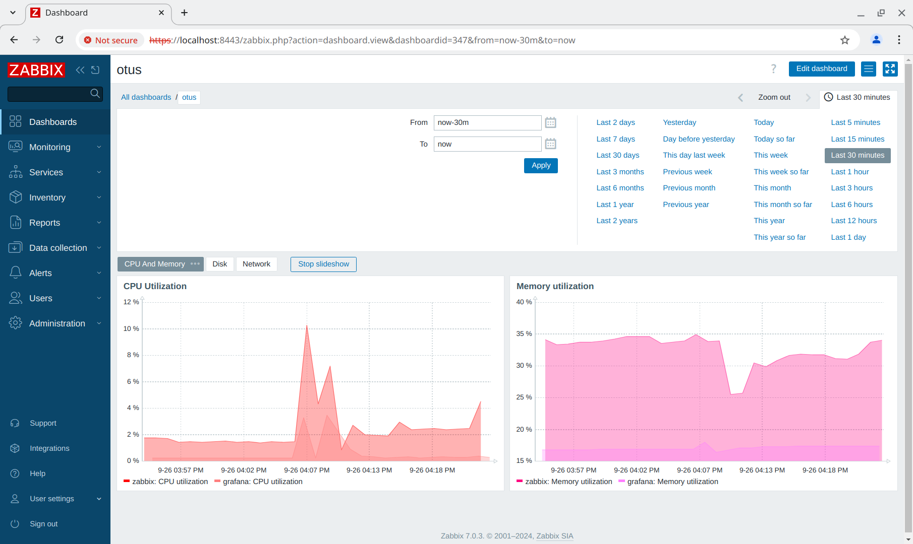

# Настройка мониторинга

## Задание

Настроить дашборд с 4-мя графиками:

- память;
- процессор;
- диск;
- сеть.

## Реализация

Задание сделано на **almalinux/9** версии **v9.4.20240805**. Для автоматизации процесса написаны следующие роли **Ansible**, поднимающие **Zabbix 7** в порядке их выполнения:

- **epel_release** - устанавливает репозиторий **Extra Packages for Enterprise Linux** для расширенных пакетов, исключая из него пакеты с **zabbix** (они почему-то не работают в **AlmaLinux** с ошибкой [cannot set list of PSK ciphersuites](https://www.zabbix.com/forum/zabbix-troubleshooting-and-problems/435752-cannot-set-list-of-psk-ciphersuites-file-ssl_lib-c-line-1383-no-cipher-match));
- **zabbix_release** - устанавливает официальные репозитории **Zabbix** для **AlmaLinux**;
- **node_exporter** - устанавливает **Prometheus Node Exporter**;
- **zabbix_agent2** - устанавилвает и настраивает **Zabbix Agent 2** (фактически в конфиге прописывается только **Server**, **ServerActive** и **Hostname** из переменных **zabbix_server_ip** и **zabbix_hostname** в [all.yml](group_vars/all.yml))
- **zabbix_server** - поднимает **Zabbix Server 7**:
  - ставит и настраивает **zabbix**, **postgresql**, **nginx**;
  - настраивает **SELinux**, включая политики **httpd_can_connect_zabbix** и **httpd_can_network_connect_db**;
  - создаёт базу данных **zabbix_db_name** (в файле [zabbix.yml](host_vars/zabbix.yml)) и настраивает к ней локальный доступ по паролю (через сокет, смотри [pg_hba](roles/zabbix_server/templates/pg_hba.conf)), пароль от базы данных сохраняется в файле `passwords/zabbix_db.txt`;
  - меняет имя пользователя и пароль администратора на значения из переменных **zabbix_admin_user** и **zabbix_admin_password** в файле [zabbix.yml](host_vars/zabbix.yml), пароль сохраняется в `passwords/zabbix_admin.txt`;
  - настраивает **zabbix-server**, создавая конфигурационные файлы [zabbix_server.conf](roles/zabbix_server/templates/zabbix_server.conf) для сервера и [zabbix.conf.php](roles/zabbix_server/templates/zabbix.conf.php) для веб-интерфейса;
  - настраивает **nginx** и запускает его и **php-fpm**;
  - удаляет `Zabbix server` из **Hosts** в базе данных **zabbix** (через его **API**) и генерит токен для подключения к серверу через **API**, токен сохраняется в `passwords/zabbix_token.txt`;
- **zabbix_inventory** - добавляет узлы **zabbix** и **grafana** в группы **Zabbix servers** и **Linux servers** узлов **Zabbix**, назначает на них шаблоны **Zabbix server health** и **Linux by Zabbix agent**.
- **zabbix_dashboards** - через **Zabbix API** создаёт **Dashboard** с именем **otus** с 3-мя вкладками **CPU And Memory**. **Disk**, **Network** из шаблона [otus](roles/zabbix_dashboards/templates/otus.yml).

## Запуск

Необходимо скачать **VagrantBox** для **almalinux/9** версии **v9.4.20240805** и добавить его в **Vagrant** под именем **almalinux/9/v9.4.20240805**. Сделать это можно командами:

```shell
curl -OL https://app.vagrantup.com/almalinux/boxes/9/versions/9.4.20240805/providers/virtualbox/amd64/vagrant.box
vagrant box add vagrant.box --name "almalinux/9/v9.4.20240805"
rm vagrant.box
```

Также необходимо обновить коллекцию **community.zabbix** до версии **3.1.2** и выше:

```shell
ansible-galaxy collection install --upgrade community.zabbix
```

После этого нужно сделать **vagrant up**.

Протестировано в **OpenSUSE Tumbleweed**:

- **Vagrant 2.3.7**
- **VirtualBox 7.0.20_SUSE r163906**
- **Ansible 2.17.4**
- **community.zabbix 3.1.2**
- **Python 3.11.10**
- **Jinja2 3.1.4**

## Проверка

1. Заходим на [localhost:8080](http://localhost:8080/index.php), вводим имя пользователя **otus** и пароль из файла `passwords/zabbix_admin.txt`.
2. Переходим в [Dashboards](http://localhost:8080/zabbix.php?action=dashboard.list) и выбираем [otus](http://localhost:8080/zabbix.php?action=dashboard.view&dashboardid=347).
3. Для того, чтобы на всех графиках появились данные необходимо подождать 10 минут, пока отработают **Discovery rules**.
4. Наблюдаем графики:

  
  
  
